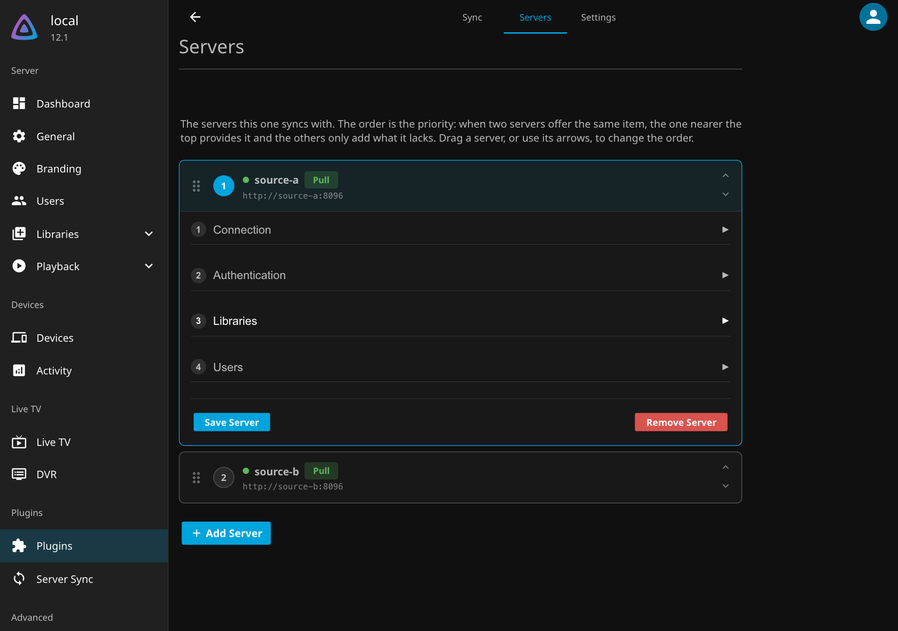
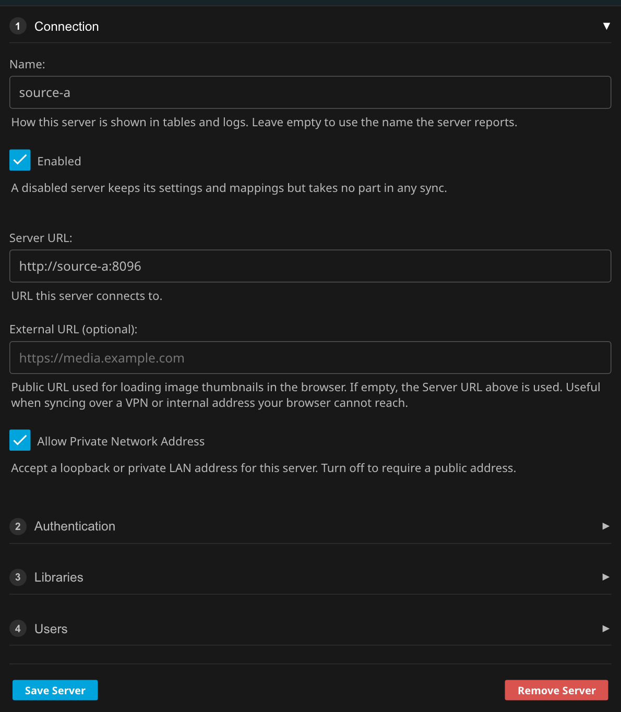
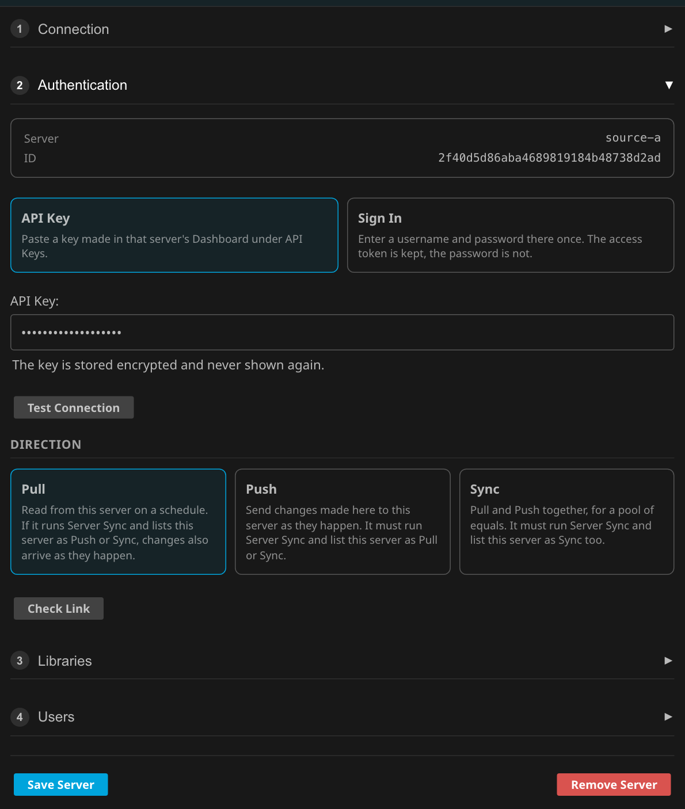
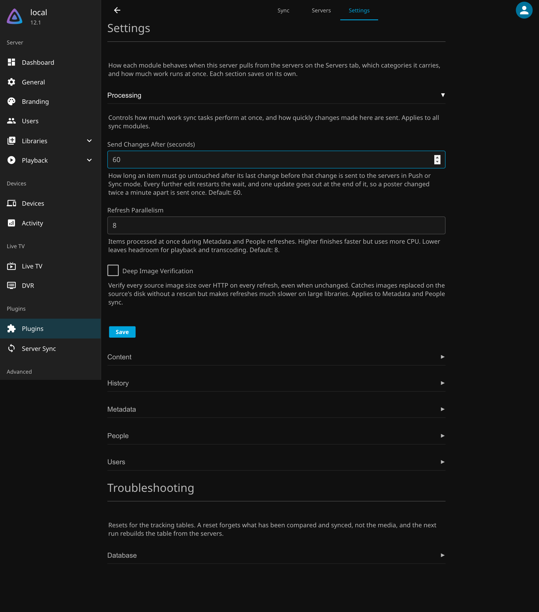
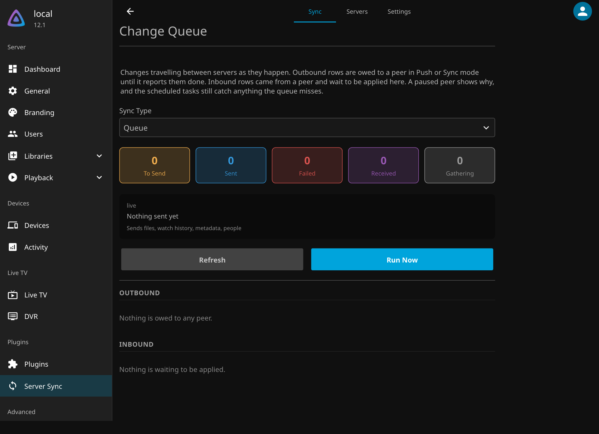

A Jellyfin plugin that keeps several Jellyfin servers in step. Keep your **Content**, **Watch History**, **Metadata**, **People**, and **User Settings** in sync across multiple Jellyfin installations, on a schedule and, between servers that both run the plugin, as changes happen.

## How It Works

Server Sync runs on your Local (destination) server and pulls data from one or more Source servers using standard Jellyfin APIs. You configure each server with its own library and user mappings, then two scheduled tasks, **Sync Content** and **Sync Information**, handle the synchronization. Content is matched by file path, allowing the plugin to track what needs to be downloaded, updated, or removed. No modifications are required on a Source server that is only scanned.

When a Source server also runs Server Sync, the two can keep each other current between scheduled runs. A server entry in **Push** or **Sync** mode is told about changes as they happen, from a play or a favorite to a metadata edit, a person edit, a user's settings, or a new file, and pulls each change within seconds. The scheduled tasks remain the safety net. See **[Live Changes](#live-changes-between-servers)**.

When several servers are configured, their order is their priority. If two servers offer the same item, the server higher in the list supplies it and the lower one only contributes what the higher one lacks. Reordering the list moves an item to the new winner on the next refresh without deleting anything already downloaded.

## Use At Your Own Risk

This plugin modifies live data on your Jellyfin server. While extensively tested, I maintain this plugin for my person use case and I do not account for every server configuration. **Always maintain backups of your Jellyfin data and configuration.** By using this plugin, you accept full responsibility for any data loss or issues that may occur.

# Setup

The plugin has three tabs. **Sync** shows every module's table and the change queue. **Servers** holds the servers this one syncs with. **Settings** holds each module's options.

## Servers

| Servers Tab |
| :--- |
|  |

The Servers tab lists every server this one syncs with, in priority order. When two servers offer the same item, the one nearer the top provides it and the others only add what it lacks. Drag a server, or use its arrows, to change the order. Press **Add Server** to add one; selecting a server opens its editor in place, with four steps.

### 1. Connection

| Connection |
| :--- |
|  |

- **Name**: An optional label. The server's own name is used when empty
- **Enabled**: A disabled server keeps its settings and mappings but takes no part in any sync
- **Server URL**: The full URL of the server (e.g., `http://192.168.1.100:8096`)
- **External URL**: An optional public URL the browser loads thumbnails from, for servers reached over a VPN or an internal address
- **Allow Private Network Address**: Accept a loopback or LAN address for this server

### 2. Authentication

| Authentication |
| :--- |
|  |

Choose one of two ways to authenticate, then press **Test Connection**. The server's name and ID appear once it answers, along with whether the key is an administrator's or a standard user's.

- **API Key**: Paste a key made on that server under **Dashboard > API Keys**. The key is stored encrypted and never shown again
- **Sign In**: Enter a username and password for that server once. The access token is kept, the password is not

Then choose the **Direction**:

- **Pull** reads from the server on a schedule. Nothing needs to be installed there. If it runs Server Sync and lists this server as Push or Sync, changes also arrive as they happen
- **Push** sends changes made here to that server as they happen. It must run Server Sync and list this server as Pull or Sync
- **Sync** does both, for a pool of equals. It must run Server Sync and list this server as Sync too

**Check Link** confirms the other server is set up for the direction you chose. See **[Live Changes](#live-changes-between-servers)**.

### 3. Libraries

| Library Mapping |
| :--- |
|  |

Libraries appear once the connection has been tested. Map each library on that server to a library on this one:

- **Library**: Select the Source and Local Libraries that should map to each other
   - *Multiple Source Libraries can be mapped to the same Local Library if desired*
- **Root Path**: The base folder each library uses for its content
   - *The Source Library file `/media/Track Testing/My Movie (2025)/movie.mp4` is saved to the Local Library at `/media/My Movie (2025)/movie.mp4`*
   - **Only single folder libraries are supported by this plugin.**
- **Library Filter**: Sync everything, a Whitelist, or everything except a Blacklist, picked from the server's files, collections, and playlists

### 4. Users

| User Mapping |
| :--- |
|  |

Map users on that server to users on this one. User mappings are only needed for History and User syncing, not for Content, Metadata, or People.

Press **Save Server** when the steps are complete. An existing single source configuration is moved into the first entry of the list the first time the plugin starts after updating.

## Settings

| Settings Tab |
| :--- |
|  |

Each module has its own section on the Settings tab, with the categories it carries and how much work runs at once. **Processing** also holds **Send Changes After**, the number of seconds an item must go untouched before a change made here is sent to the servers in Push or Sync mode. Each section saves on its own. **Troubleshooting** holds the table resets, which forget what has been compared and synced without touching any media.

---

# Syncing Types

| Sync Table |
| :--- |
|  |

## Scheduled Tasks

Two tasks do the work, each running the module steps below in order under one progress bar.

* **Sync Content** refreshes the content table from every scan server, downloads queued files, processes deletions, and syncs collections.
* **Sync Information** runs the metadata, people, user, and history comparisons, refresh then apply for each module that is enabled.

The per module Refresh and Sync steps are still available from the dashboard's buttons, but they no longer keep schedules of their own.

## Live Changes Between Servers

Every server entry has a direction. **Pull** reads from that server on a schedule and needs nothing installed there; if that server runs Server Sync and lists this one as Push or Sync, changes also arrive as they happen. **Push** sends changes made here to that server as they happen, which needs Server Sync there listing this server as Pull or Sync, since it pulls the change from here. **Sync** does both, for a pool of equals, and needs the peer to list this server as Sync too. The **Check Link** button on a server judges the pairing by the direction chosen: green when it is ready, yellow for a Pull that will work on a schedule but not live, red for a Push or Sync the other side is not set up for. It also compares the two servers' clocks and warns when they differ by more than half a minute, since edits made on both servers close together are settled by those clocks.

A standard user's key, from signing in as someone who is not an administrator, pulls what that user can see and that one user's watch history, one way. Push and Sync, two way history, and user sync need an administrator's key, because Server Sync's own endpoints and the user APIs on the other server require elevation. The page says which kind of key an entry holds after a connection test or sign in.

A server only announces the kinds of change the other side applies: it reads the peer's enabled modules every few minutes and skips the rest, and the peer declines anything it does not want in the meantime. Edits to one object are gathered until it has gone untouched for sixty seconds, adjustable under Settings > Processing, and then sent once, so a poster changed twice a minute apart travels once and a playback that reports progress every few seconds travels once it stops. A change is announced as a hint that says what changed and where, never the value. The other server pulls the live state through the same code the scan uses, so a hint and a scan can never disagree. Hints are kept on both ends until the work is done, retried with backoff, and recovered if lost, and the dashboard shows both queues and any paused peer with the reason. A write made because of a hint never raises a hint of its own, and a value that already matches is never written, so a pool of three or more servers settles without echoing.

When two servers disagree, watch history merges three way against what the servers last agreed on, and everything else resolves on where and when the value was last edited, so the newest edit wins. A metadata edit, or an image uploaded or picked by hand, raises an item hint. Metadata and images a provider fetches during a scan or a refresh are left to the scheduled scan. Replacements and removals of files are also left to Sync Content.

| Change Queue |
| :--- |
|  |

The **Queue** view on the Sync page shows what is owed to each peer, what peers have sent that is not yet applied, and each peer's delivery state with the reason when it is paused. When a change here matched no library or user mapping on any Push or Sync server, the view says so and names the last one, since that is the usual reason nothing is sent. Every hint that reaches a conclusion also writes a line to Jellyfin's activity log. A paused peer keeps at most ten thousand pending hints; beyond that the oldest are dropped and the scheduled tasks carry the change instead. Each item's detail dialog shows which server last edited it and when.

| Item Detail |
| :--- |
|  |

Removing a server entry also removes the sync rows tracked from it and any hints owed to it. Files already downloaded stay where they are.

## Content Syncing

Content Syncing copies media files from the Source Server and mirrors them on your Local Server. This is performed in two steps: **Refresh Sync Table** & **Sync Content**.

### Refresh Sync Table

The Plugin builds a table of all content that exists in the mapped Source Libraries. Source Server files are compared, **by file path**, against files on the Local Server. The following content states are tracked:

* Files missing on Local Server are Queued for download *(or Pending when `Download New Content` is set to require approval)*
* Files no longer on Source Server are set to Delete only when `Delete Missing Content` is enabled *(off by default)*
* External subtitle companion files are included with their parent media

Each Library Mapping can sync everything, a Whitelist, or everything except a Blacklist. The item picker browses Files, Collections, and Playlists. A whitelisted Collection or Playlist syncs whatever it currently contains, checked on every Refresh, so anyone who can edit it on the Source Server controls what syncs. A blacklisted Collection or Playlist excludes its items the same way. Whitelisted Collections are also recreated on the Local Server with the synced copies of their items when `Mirror Synced Collections` is enabled.

Files can be manually approved or ignored using the Approval Process.

Setting a file to Ignored will skip any future actions.

### Sync Content

Using the files found in the Sync Table, all Queued files are downloaded using Jellyfin's API into the Temporary Directory. Once downloaded, files are moved to the mirrored location on the Local Server and any required folders are created. Files with the Pending & Ignored statuses are not processed. Files set to Delete are removed during this step.

#### For complete information, please see our **[Content Syncing Documentation](docs/Content.md)**!

## History Syncing

History Syncing copies watch history from the Source Server and mirrors it on your Local Server. This is performed in two steps: **Refresh Sync Table** & **Sync History**.

### Refresh Sync Table

The Plugin builds a table of all content that exists on both the Source Server and the Local Server. Source Server watch history is compared, **by file path**, against the Local Server. The following history fields are tracked:

* Played Status (from the most recently played server)
* Play Count (uses the greater value between servers)
* Playback Position (from the most recently played server)
* Last Played Date (from the most recently played server)
* Favorite Status (always taken from Source Server, unless negotiating)

Items with history that varies are Queued for import.

With **Negotiate With Source Server** enabled, the merged history is also written back to the Source Server through the Server Sync plugin installed there, so watch state flows both ways. Each write is accepted by the Source Server only when its state has not changed since it was read, and a change made on one server alone always wins over an unchanged server.

Setting a file to Ignored will skip any future actions.

### Sync History

Using the watch history found in the Sync Table, all Queued records update content history using Jellyfin's API.

#### For complete information, please see our **[History Syncing Documentation](docs/History.md)**!

## Metadata Syncing

Metadata Syncing copies media metadata from the Source Server and mirrors them on your Local Server. This is performed in two steps: **Refresh Sync Table** & **Sync Metadata**.

### Refresh Sync Table

The Plugin builds a table of all content that exists on both the Source Server and the Local Server. Source Server metadata is compared, **by file path**, against the Local Server. The following metadata categories are tracked individually:

* Metadata (Name, Overview, Ratings, Dates, etc.)
* Genres
* Tags
* Studios
* People (Actors, Directors, Writers)
* Images (Primary, Backdrop, Logo, etc.)

Items with metadata that varies from the Source Server are Queued for import.

Setting a file to Ignored will skip any future actions.

### Sync Metadata

Using the metadata found in the Sync Table, all Queued records update content metadata using Jellyfin's API.

#### For complete information, please see our **[Metadata Syncing Documentation](docs/Metadata.md)**!

## People Syncing

People Syncing copies person metadata from the Source Server and mirrors it on your Local Server. This is performed in two steps: **Refresh Sync Table** & **Sync People**.

### Refresh Sync Table

The Plugin builds a table of all people associated with your synced metadata items (actors, directors, writers). Each person's full record is fetched from the Source Server and compared against the Local Server's person entity. People are matched across servers **by name**. The following categories are tracked:

* Metadata (Name, Overview, Birth/Death Dates, Sort Names, Provider IDs, Tags, Lock Status)
* Images (compared by type count and file size)

People with metadata or images that vary from the Source Server are Queued for import.

Setting a person to Ignored will skip any future actions.

### Sync People

Using the people found in the Sync Table, all Queued records update person metadata and images using Jellyfin's internal APIs.

#### For complete information, please see our **[People Syncing Documentation](docs/People.md)**!

## User Syncing

User Syncing copies user images, settings, and configuration from the Source Server and mirrors them on your Local Server. This is performed in two steps: **Refresh Sync Table** & **Sync Users**.

### Refresh Sync Table

The Plugin builds a table of all mapped users that exist on both the Source Server and the Local Server. Source Server user configuration is compared against the Local Server. The following user settings are tracked:

* Profile Images
* Policy (permissions and library access, translated to local library IDs)
* Configuration (playback preferences, subtitle mode, display settings)

Users with configuration that varies from the Source Server are Queued for import.

Setting a user to Ignored will skip any future actions.

### Sync Users

Using the user configurations found in the Sync Table, all Queued records update user settings using Jellyfin's API.

#### For complete information, please see our **[User Syncing Documentation](docs/Users.md)**!

---

# API

Server Sync adds a small HTTP API to Jellyfin. Two servers that both run the plugin talk to each other through the **Peer** routes, and the dashboard's Servers tab and Queue view use the **Hints** and **Servers** routes. Every route sits behind Jellyfin's own `RequiresElevation` policy, so the caller must present an API key or an administrator's access token that the receiving server issued. The plugin adds no authentication of its own. A standard user's token is refused with `403`, and no token with `401`.

Requests and responses are JSON. Property names are Pascal case, enums travel as their names, and dates are UTC in ISO 8601. The server reads property names without regard to case.

```bash
curl -H 'Authorization: MediaBrowser Token="YOUR_API_KEY"' http://server:8096/ServerSync/Peer/Capabilities
```

## Peer routes

These are what one Server Sync installation calls on another. You will not normally call them yourself, but they are plain HTTP and can be exercised from the command line.

### GET /ServerSync/Peer/Capabilities

What this installation can negotiate. A `404` means the plugin is not installed there, or predates peer support.

```json
{
  "ServerId": "2f40d5d86aba4689819184b48738d2ad",
  "PluginVersion": "12.2.1.1",
  "Features": ["history-negotiate", "hints"],
  "Accepts": ["History", "Metadata", "People"],
  "ServerTime": "2026-10-03T19:30:47.9590000Z"
}
```

`Accepts` lists the kinds this server applies, which are the modules that are on. A sender announces only those kinds. `ServerTime` is the peer's clock, which Check Link compares against the caller's.

### GET /ServerSync/Peer/Link?serverId={id}

Whether, and how, this server lists the asking server. A server about to Push asks this first, since hints are only accepted from a server listed as Pull or Sync.

```json
{
  "ServerId": "…",
  "ServerName": "local",
  "Listed": true,
  "Mode": "Sync",
  "Enabled": true,
  "PullsFromYou": true,
  "SendsToYou": true
}
```

### POST /ServerSync/Peer/Queue

Offer a batch of change hints. A hint says what changed and where, never the value; the receiver pulls the live state from the sender afterwards. The sender must be configured on the receiver as a Pull or Sync server, and every hint's `OriginServerId` must equal `SenderServerId`, since hints are never forwarded. At most 500 hints per request.

```json
{
  "SenderServerId": "2f40d5…",
  "Items": [
    {
      "HintId": "2f40d5…:42",
      "OriginServerId": "2f40d5…",
      "Kind": "Metadata",
      "Key": "9c1e0f…",
      "ItemPath": "/media/Movies/Only A (2021)/Only A (2021).mp4",
      "ItemId": "9c1e0f…",
      "UserId": null,
      "UserName": null,
      "VersionServerId": "2f40d5…",
      "VersionTimestamp": "2026-10-03T19:30:47Z"
    }
  ]
}
```

`Kind` is one of `History`, `Metadata`, `People`, `Content`, or `Users`. `Key` is the sender's own key for the object: the item id for metadata and content, the user id for users, the person's name for people, and `userId|itemId` for history. `ItemPath` and `UserName` are what the receiver maps through its own library and user mappings for the sender.

The answer is one result per hint, in request order. `200` means queued, not applied. A hint for something the receiver does not map is answered as not accepted with the reason, and the sender treats that as done.

```json
{
  "Items": [
    { "HintId": "2f40d5…:42", "Accepted": true, "Reason": null },
    { "HintId": "2f40d5…:43", "Accepted": false, "Reason": "the path is not in a library mapped on this server" }
  ]
}
```

| Status | Meaning on the sender |
| --- | --- |
| `200` | Queued. The rows are marked sent and wait for completion. |
| `400` | Malformed. The whole batch is checked before any of it is stored. Permanent for those rows. |
| `401` or `403` | The key is refused. The peer is paused for fifteen minutes. |
| `404` | No Server Sync behind that URL. The peer is paused. |
| `409` | The receiver does not list the sender as Pull or Sync. The peer is paused with the reason. |
| anything else | Retried with backoff of one minute, five, fifteen, then one hour, forever. |

### POST /ServerSync/Peer/Complete

A receiver reports hints as done. The origin removes the matching outbound rows, but only when the row still carries the version that was applied, so an edit made after delivery is not lost to a late completion.

```json
{
  "SenderServerId": "…",
  "Items": [ { "HintId": "2f40d5…:42", "VersionTimestamp": "2026-10-03T19:30:47Z" } ]
}
```

Answers `{ "Removed": 1 }`.

### GET /ServerSync/Peer/Status

This server's inbound queue and the hints it finished in the last day. An origin reads it for rows that were sent and not completed after ten minutes: a hint still held means the peer is working, a hint in `CompletedHints` with a version at least the row's is done, and a hint that is neither was lost and is sent again. This is also how an origin learns of completions from a peer that holds a standard user's key for it and so cannot call `Complete`.

```json
{
  "ServerId": "…",
  "Inbound": [
    { "Id": 7, "HintId": "…:42", "OriginServerId": "…", "Kind": "Content", "Key": "…", "ReceivedAt": "…", "Attempts": 0, "LastError": null }
  ],
  "Completed": ["…:41"],
  "CompletedHints": [ { "HintId": "…:41", "VersionTimestamp": "…" } ]
}
```

### POST /ServerSync/Peer/Versions

The versions this server holds for a batch of its own keys. Used by the full scan against a peer that carries versions, so conflicts resolve on where and when a value was last edited rather than on saved dates. Keys with no recorded version are left out. At most 500 keys per request.

```json
{ "Kind": "Metadata", "Keys": ["9c1e0f…", "77ab12…"] }
```

```json
{ "Items": [ { "Kind": "Metadata", "Key": "9c1e0f…", "ServerId": "…", "Timestamp": "2026-10-03T19:30:47Z" } ] }
```

### POST /ServerSync/Peer/History

Negotiate watch history. Each entry proposes a merged state for one of the receiver's user and item pairs and says what the sender believes the receiver currently holds. The receiver writes only when its live state still matches `Expected`, answers `Stale` with its live state otherwise, and records the agreed state in its own row for the sender so both sides merge three way from the same base next time. At most 500 entries per request.

```json
{
  "SenderServerId": "…",
  "Items": [
    {
      "UserId": "receiver user id",
      "ItemId": "receiver item id",
      "Expected": { "Played": true, "PlayCount": 1, "PlaybackPositionTicks": 0, "LastPlayedDate": "…", "IsFavorite": false },
      "Proposed": { "Played": true, "PlayCount": 2, "PlaybackPositionTicks": 0, "LastPlayedDate": "…", "IsFavorite": true },
      "SenderUserId": "sender user id",
      "SenderItemId": "sender item id"
    }
  ]
}
```

```json
{
  "Items": [
    { "UserId": "…", "ItemId": "…", "Outcome": "Applied", "Reason": null, "Current": { "Played": true, "PlayCount": 2, "PlaybackPositionTicks": 0, "LastPlayedDate": "…", "IsFavorite": true } }
  ]
}
```

`Outcome` is `Applied`, `Unchanged`, `Stale`, `NotFound`, or `Failed`. A null field in a state means no opinion and matches anything.

### DELETE /ServerSync/Peer/Queue/{id}

Removes one inbound row by its `Id` from `Status`, for a row that will never apply. Answers `204`, or `404` when there is no such row.

## Operator routes

These back the dashboard, and are handy for scripting or for watching a pool from the outside.

### GET /ServerSync/Hints

Both queues on this server and the delivery state of every peer it sends to.

```json
{
  "Pending": 0,
  "Outbound": [
    { "Id": 42, "HintId": "…:42", "PeerKey": "…", "PeerName": "source-a", "Kind": "Metadata", "Key": "…", "ItemPath": "…", "UserName": null,
      "State": "Sent", "Attempts": 1, "NextAttempt": "…", "SentAt": "…", "LastError": null, "CreatedAt": "…" }
  ],
  "Inbound": [ { "Id": 7, "HintId": "…", "OriginServerId": "…", "Kind": "History", "Key": "…", "ReceivedAt": "…", "Attempts": 0, "LastError": null } ],
  "Peers": [ { "Key": "…", "Name": "source-a", "LastAttempt": "…", "PausedUntil": null, "Reason": null, "Sends": ["History", "Metadata", "People"] } ]
}
```

`Pending` counts local edits still gathering before they become hints. `Unmatched` counts local changes since start that no Push or Sync server mapped, with the last one described in `LastUnmatched`, which is the first thing to check when nothing is being sent. `State` is `Pending`, `Sent`, or `Failed`. A paused peer carries `PausedUntil` and the `Reason`. `Sends` lists the kinds this server sends to that peer, which are the modules selected there, or is null until the peer has said. The lists hold at most five hundred rows each; `OutboundCounts` by state name and `InboundCount` cover the whole table.

### POST /ServerSync/Hints/Run

Raises every gathering edit, delivers, and applies now instead of waiting for the workers. Answers `204`.

### POST /ServerSync/Hints/CheckPeer

What the Servers tab's Check Link button calls. Judges a server entry against the direction it is about to be saved with.

```json
{ "ServerUrl": "http://source-a:8096", "ApiKey": "…", "ServerKey": "entry key", "AllowPrivateNetwork": true, "Mode": "Sync" }
```

`ApiKey` may be the stored key's sentinel `__JPK_SECRET_KEPT__` with `ServerKey` naming the entry, so a key never has to be re-entered. `Mode` is `Pull`, `Push`, or `Sync`.

```json
{
  "Reachable": true, "ServerName": "source-a", "ServerId": "…",
  "HasPlugin": true, "PluginVersion": "12.2.1.0", "SupportsHints": true,
  "ListsThisServer": true, "PeerMode": "Sync", "SendsToThisServer": true,
  "Accepts": ["History", "Metadata", "People"],
  "ClockSkewSeconds": 0,
  "Severity": "ok",
  "Message": "Ready. Server Sync 12.2.1.0 there lists this server as Sync, so changes travel both ways as they happen."
}
```

`Severity` is `ok`, `warn`, or `error`, which the page shows as green, yellow, or red.

### GET /ServerSync/Hints/Version?kind={kind}&localItemId={id}&localUserId={id}&name={name}

The version an object carries on this server: which server last edited it and when. Pass `localItemId` for `Metadata` and `Content`, `localUserId` for `Users`, both for `History`, and `name` for `People`. Answers `204` when no edit has been recorded since versions began.

```json
{ "ServerId": "…", "ServerName": "source-a", "Timestamp": "2026-10-03T19:30:47Z", "IsThisServer": false }
```

### DELETE /ServerSync/Hints/Outbound/{id} and DELETE /ServerSync/Hints/Inbound/{id}

Discard one row from either queue by its `Id`. The scheduled tasks still carry the change. Answers `204`, or `404`.

### DELETE /ServerSync/Servers/{key}/Rows

Removes every sync row and queued hint that came from one server entry, by the entry's `Key`. The Servers tab calls this after a server is removed. Files already downloaded are not touched.

```json
{ "Content": 11, "History": 4, "Metadata": 11, "People": 1, "Users": 2, "Hints": 0 }
```

---

# Versioning

Releases use a four part version, `JJ.JJ.F.B`, that matches the supported Jellyfin version with the plugin's own feature and bug count:

```
12.0.1.2
└──┘ └┬┘
 │    └── 1 = Plugin feature release
 │        2 = Plugin bug/patch release within that feature
 │
 └─── 12.0 = Jellyfin version this build was tested/released for
```

# Installation

## Step 1: Add Plugin Repository

* Open Jellyfin and navigate to Dashboard → Plugins → Repositories
* Click Add Repository
* Enter the following repository URL: `https://raw.githubusercontent.com/JPKribs/jellyfin-plugin-serversync/master/manifest.json`
* Click Save

## Step 2: Install Plugin

* Go to the Catalog tab in the Plugins section
* Find Server Sync in the catalog
* Click Install
* Wait for installation to complete

## Step 3: Restart Jellyfin

* Restart your Jellyfin server completely
* Wait for Jellyfin to fully start up

## Verification Check

* After restart, navigate to Dashboard → Plugins → Server Sync to confirm the plugin configuration page loads properly.

---

## AI Disclaimer

Claude Code was utilized in the initial structure of this project and first drafts of documentation. All code has been manually reviewed, tested, and revised after its generation. This disclaimer exists in the interest of transparency.

**All code was written, or code reviewed and tested, by humans.**
